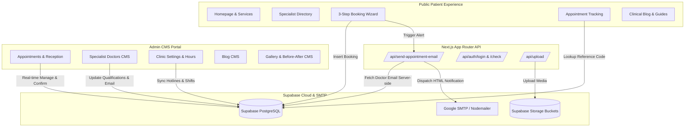
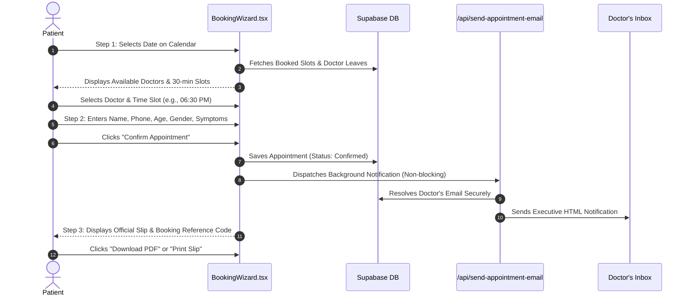

# KGH Dental Care — Complete Technical & User Documentation
**Project:** KGH Dental — Multi-Specialty Dental Clinic Web Application & Smart Chamber Management System  
**Version:** 1.0.0 (Production Ready)  
**Author / Team:** KGH Development Team  
**Last Updated:** September 2026  


Listed directory docs
Created kgh_documentation.md
Ran command: `git status -s`
Ran command: `git add kgh_documentation.md; git commit -m "docs: add comprehensive end-to-end technical and user manual in kgh_documentation.md"; git push origin main`

আপনার চাহিদা অনুযায়ী **KGH Dental** ওয়েবসাইটের সম্পূর্ণ ইউজার ও টেকনিক্যাল ডকুমেন্টেশন তৈরি করে [`kgh_documentation.md`](file:///f:/G_Development/All%20Project%20from%20Shadly%20Bhai/KGH/KGH_Client-github/kgh_documentation.md) ফাইলে সেভ করা হয়েছে এবং **GitHub-এও পুশ (`37b1de9`)** করে দেওয়া হয়েছে।

---

### 📄 ডকুমেন্টেশনে যা যা বিশদভাবে অন্তর্ভুক্ত করা হয়েছে:

1. **টেকনোলজি স্ট্যাক ও আর্কিটেকচার:**
   - Next.js 16 (App Router + Turbopack), React 19, Tailwind CSS v4, Supabase Cloud PostgreSQL, এবং Nodemailer।
   - সম্পূর্ণ ডাটা ফ্লো ও আর্কিটেকচারাল Mermaid ডায়াগ্রাম।

2. **পাবলিক ইউজার ও পেশেন্ট এক্সপেরিয়েন্স গাইড:**
   - **হোমপেজ ও স্পেশালিস্ট নেভিগেশন:** ৭টি বিশেষায়িত ডিপার্টমেন্ট, ডক্টর প্রোফাইল ও টেস্টিমোনিয়াল।
   - **৩-ধাপের স্মার্ট বুকিং উইজার্ড:**
     - ক্যালেন্ডার সিলেকশন ও রিয়েল-টাইম স্লট কলিশন প্রতিরোধ (ডাবল বুকিং রোধ)।
     - রোগীর ডেমোগ্রাফিক্স (বয়স, জেন্ডার, ফোন ও উপসর্গ)।
     - অটোমেটিক রেফারেন্স কোড ও ভেক্টর PDF ডাউনলোড/প্রিন্ট স্লিপ।
   - **লাইভ ট্র্যাকিং সিস্টেম (`/appointment/track`):** রেফারেন্স কোড বা ফোন দিয়ে স্ট্যাটাস ট্র্যাকিং।
   - **দ্বিভাষিক সিস্টেম:** বাংলা ও ইংরেজির নিখুঁত ক্লিনিক্যাল টার্মিনোলজি সাপোর্ট।

3. **এডমিন ড্যাশবোর্ড ও ক্লিনিক অপারেশনস ম্যানুয়াল:**
   - **অথেন্টিকেশন ও সিকিউরিটি (`/admin/login`):** সেশন ও সুরক্ষিত কুকি ম্যানেজমেন্ট।
   - **রিসেপশন ও অ্যাপয়েন্টমেন্ট ম্যানেজমেন্ট (`/admin/appointments`):** আনরিড ব্যাজ, ওয়ান-ক্লিক WhatsApp কনফার্মেশন, স্ট্যাটাস আপডেট এবং Excel/CSV এক্সপোর্ট।
   - **ডক্টর লিভ ও হলিডে ব্লকার:** ডাক্তারদের ছুটির দিন ক্যালেন্ডারে ব্লক করার নিয়ম।
   - **ডক্টরস রেজিস্ট্রি (`/admin/doctors`):** নতুন ডক্টর যুক্ত করা, BMDC নম্বর, শিডিউল ও নোটিফিকেশন ইমেইল কনফিগারেশন।
   - **ক্লিনিক সেটিংস ও শিফট আওয়ার্স (`/admin/settings`):** হটলাইন, সাপ্তাহিক কাজের সময় ও রিসেপশন ইমেইল লাইভ সিঙ্ক।
   - **ব্লগ, গ্যালারি (Before/After স্লাইডার) ও রিভিউ CMS গাইড।**

4. **স্বয়ংক্রিয় ইমেইল নোটিফিকেশন ইঞ্জিন:**
   - ব্যাকগ্রাউন্ড ডিসপ্যাচ মেকানিজম ও ডক্টরের ব্যক্তিগত ইমেইলের কঠোর সিকিউরিটি (ফ্রন্টএন্ড থেকে সম্পূর্ণ আলাদা)।
   - গুগলের ১৬ অক্ষরের অ্যাপ পাসওয়ার্ড তৈরির পূর্ণাঙ্গ নির্দেশিকা।
   - অফলাইন ও গ্রেসফুল ফলব্যাক গ্যারান্টি।

5. **ডাটাবেজ স্কিমা ও সুপাবেস কোয়েরিজ:**
   - প্রতিটি টেবিলের বিবরণ, RLS পলিসি ও এক ক্লিকে মাইগ্রেশন চালানোর কোয়েরি।

6. **এনভায়রনমেন্ট ভ্যারিয়েবল ও ডেপ্লয়মেন্ট গাইড:**
   - লোকাল সেটআপ এবং Vercel-এ প্রডাকশন ডেপ্লয়মেন্টের সহজ ধাপ।

7. **ট্রাবলশুটিং, FAQ ও মেইনটেন্যান্স রুনবুক।**

---

আপনি সরাসরি প্রজেক্টের রুট ডিরেক্টরি থেকে [`kgh_documentation.md`](file:///f:/G_Development/All%20Project%20from%20Shadly%20Bhai/KGH/KGH_Client-github/kgh_documentation.md) ফাইলটি অথবা GitHub রিপোজিটরি থেকে এটি দেখতে ও শেয়ার করতে পারবেন।


---

## 📑 Table of Contents

1. [Executive Summary & Technology Stack](#1-executive-summary--technology-stack)
2. [System Architecture & Data Flow](#2-system-architecture--data-flow)
3. [Public Patient & Visitor Guide (Frontend)](#3-public-patient--visitor-guide-frontend)
   - [3.1 Homepage & Clinical Brand Experience](#31-homepage--clinical-brand-experience)
   - [3.2 Smart Appointment Booking Wizard (3-Step Engine)](#32-smart-appointment-booking-wizard-3-step-engine)
   - [3.3 Real-Time Appointment Tracking System](#33-real-time-appointment-tracking-system)
   - [3.4 Specialist Doctors Directory](#34-specialist-doctors-directory)
   - [3.5 Clinical Departments & Sub-Services](#35-clinical-departments--sub-services)
   - [3.6 Bilingual Localization Engine (English & Bengali)](#36-bilingual-localization-engine-english--bengali)
   - [3.7 Dental Health Library & SEO Blog](#37-dental-health-library--seo-blog)
   - [3.8 Clinic Contact, Map & Chamber Info](#38-clinic-contact-map--chamber-info)
4. [Admin Dashboard & Clinic Operations Manual](#4-admin-dashboard--clinic-operations-manual)
   - [4.1 Security & Authentication (`/admin/login`)](#41-security--authentication-adminlogin)
   - [4.2 Executive Dashboard (`/admin`)](#42-executive-dashboard-admin)
   - [4.3 Appointment Management & Reception Desk (`/admin/appointments`)](#43-appointment-management--reception-desk-adminappointments)
   - [4.4 Doctor Leave & Calendar Blocked Dates Manager](#44-doctor-leave--calendar-blocked-dates-manager)
   - [4.5 Specialist Doctors Registry (`/admin/doctors`)](#45-specialist-doctors-registry-admindoctors)
   - [4.6 Clinic Settings, Hotlines & Working Hours (`/admin/settings`)](#46-clinic-settings-hotlines--working-hours-adminsettings)
   - [4.7 Department & Specialized Treatments Manager (`/admin/departments`)](#47-department--specialized-treatments-manager-admindepartments)
   - [4.8 Clinical Blog & Patient Education CMS (`/admin/blog`)](#48-clinical-blog--patient-education-cms-adminblog)
   - [4.9 Smile Transformations & Gallery CMS (`/admin/gallery`)](#49-smile-transformations--gallery-cms-admingallery)
   - [4.10 Verified Google Reviews Manager (`/admin/reviews`)](#410-verified-google-reviews-manager-adminreviews)
   - [4.11 Cloud Media & Asset Manager (`/admin/media`)](#411-cloud-media--asset-manager-adminmedia)
5. [Automated Email Notification Engine (Nodemailer)](#5-automated-email-notification-engine-nodemailer)
   - [5.1 Workflow & Dispatch Architecture](#51-workflow--dispatch-architecture)
   - [5.2 Doctor Email Privacy & Security Insulation](#52-doctor-email-privacy--security-insulation)
   - [5.3 Google 16-Character App Password Setup](#53-google-16-character-app-password-setup)
   - [5.4 Fallback & Offline Resilience Mechanism](#54-fallback--offline-resilience-mechanism)
6. [Database Schema & Supabase Migrations](#6-database-schema--supabase-migrations)
   - [6.1 Database Tables Overview](#61-database-tables-overview)
   - [6.2 Row Level Security (RLS) Policies](#62-row-level-security-rls-policies)
   - [6.3 Executing Migrations](#63-executing-migrations)
7. [Environment Variables Reference](#7-environment-variables-reference)
8. [Local Development & Deployment Guide](#8-local-development--deployment-guide)
   - [8.1 Running Locally](#81-running-locally)
   - [8.2 Deploying to Vercel](#82-deploying-to-vercel)
9. [Troubleshooting, FAQ & Maintenance](#9-troubleshooting-faq--maintenance)

---

## 1. Executive Summary & Technology Stack

The **KGH Dental Web Application** is a multi-specialty clinical platform engineered for **KGH Dental Care (Dhaka, Bangladesh)**. It bridges the gap between prospective patients seeking precision dental care and clinical administrators managing multi-specialist chamber schedules.

### Technology Architecture:
| Layer | Technologies Used | Key Purpose |
| :--- | :--- | :--- |
| **Framework** | **Next.js 16.3.4 (App Router & Turbopack)** | Ultra-fast Server-Side Rendering (SSR), Server Components, and Dynamic Route Handlers. |
| **UI Library** | **React 19.2.8** | Concurrent state management, transitions, and component lifecycle. |
| **Styling** | **Tailwind CSS v4** | Modern, tokenized utility-first styling with hardware-accelerated animations. |
| **Database & Auth** | **Supabase (PostgreSQL + RLS + Storage)** | Real-time cloud persistence, secure public booking insertions, and media asset storage. |
| **Email Service** | **Nodemailer + Google SMTP** | Serverless-ready email alerts dispatched directly to specialists upon booking. |
| **PDF & Export** | **jsPDF + html2canvas** | Client-side vector & canvas PDF rendering for official patient appointment slips. |
| **Icons & Typography**| **Lucide React + Next/Font (Inter)** | Crisp clinical iconography and typographic legibility across screens. |
| **State Sync** | **React Context API + Custom Broadcast Events** | Zero-latency cross-component reactive updates without redundant network polling. |

---

## 2. System Architecture & Data Flow



---

## 3. Public Patient & Visitor Guide (Frontend)

### 3.1 Homepage & Clinical Brand Experience (`/`)
The homepage establishes clinical authority and trust through:
- **Hero Section:** Clear value proposition, urgent contact hotline, and prominent *"Book Appointment"* CTA.
- **Specialty Grid:** 7 specialized clinical wings (Prosthodontics, Orthodontics, Oral & Maxillofacial Surgery, Endodontics, Conservative Dentistry, Pediatric Dentistry, Periodontics).
- **Specialist Preview:** Interactive cards featuring consultants, qualifications (BDS, FCPS, MS), and chamber availability.
- **Why Choose KGH:** Sterilization protocols, German/US technology standards, and transparent treatment pricing.
- **Smile Gallery (Before/After Slider):** Real clinical transformations with interactive drag-to-compare sliders.
- **Patient Reviews:** Curated, verified Google Reviews highlighting painless procedures and precision care.

---

### 3.2 Smart Appointment Booking Wizard (3-Step Engine) (`/appointment`)
The booking system is structured into a streamlined 3-step wizard:



#### Step 1: Date, Doctor & Time Slot Selection
- **Chamber Calendar (`CalendarMonthView.tsx`):**
  - Displays dates for the next 3 months.
  - Automatically highlights dates on which doctors have clinic hours.
  - Filters out official clinic off-days or individual doctor leaves (configured via Admin Leave Manager).
- **Doctor & Real-Time Slot Collision Prevention:**
  - Selecting a date dynamically displays available specialists.
  - Generates 30-minute interval consultation slots.
  - Cross-checks with existing database bookings to disable already booked slots, preventing double booking.

#### Step 2: Patient Demographic & Clinical Details
- **Patient Full Name:** Required for official medical record.
- **Patient Mobile Phone:** Required for SMS/WhatsApp verification.
- **Patient Age (Years):** Essential for pediatric vs. adult clinical preparation.
- **Patient Gender:** Selectable (Male, Female, Child, Other).
- **Patient Email (Optional):** For receiving appointment slips.
- **Dental Issue / Symptoms (Optional):** Helps the specialist review chief complaints (e.g., cold sensitivity, wisdom tooth swelling, broken crown) beforehand.

#### Step 3: Official Confirmation & Instant Digital Slip
- **Reference Code Generation:** Instant clinical code in format `KGH-[DOC_INITIALS][YEAR][DAY][MONTH]-[RANDOM_SEQ]` (e.g., `#KGH-ADS202626Sep-001`).
- **Official Print Slip (`AppointmentPrintSlip.tsx`):**
  - Embedded clinic logo, hotline, and address.
  - Patient demographics (Age, Gender, Phone).
  - Specialist name, department, consultation date, and assigned slot.
- **One-Click Actions:**
  - **Download PDF:** Generates a vector PDF slip locally using `jsPDF`.
  - **Print Token:** Formats a printer-optimized slip ready for receipt printers.
  - **Copy Reference Code:** Copies tracking reference for quick lookup.

---

### 3.3 Real-Time Appointment Tracking System (`/appointment/track`)
Patients can track their serial status at any time:
1. Navigate to `/appointment/track` or append `?ref=YOUR_CODE` to the URL.
2. Enter the **Reference Code** (e.g., `KGH-ADS202626Sep-001`) or **Patient Mobile Phone**.
3. The page fetches current verification status (`Confirmed`, `Pending`, `Completed`, or `Cancelled`), appointment schedule, and assigned doctor details.

---

### 3.4 Specialist Doctors Directory (`/doctors`)
- Dedicated profiles for all consultant surgeons and specialists.
- Shows qualifications, university degrees, BMDC registration number, academic designations, and bio.
- Recurring weekly schedule (e.g., *"Saturday only: 5:30 PM – 9:00 PM"*).
- Direct *"Book Appointment with Dr. [Name]"* button pre-selects the doctor in the booking wizard.

---

### 3.5 Clinical Departments & Sub-Services (`/services` and `/services/[slug]`)
- Comprehensive coverage of 7 departments with dedicated landing pages.
- Every department contains detailed sub-services explaining:
  - **Why** the treatment is needed.
  - **When** to see the dentist.
  - **Benefits** of modern intervention.
  - **Lead Specialist** heading the department.

---

### 3.6 Bilingual Localization Engine (English & Bengali)
- **Language Switcher:** Toggle button located in the primary navigation bar.
- Supported across all text tokens, doctor names, medical degrees, symptom labels, and calendar days.
- **LanguageContext (`useLanguage`):** Persists user selection in `localStorage` across page navigations.

---

### 3.7 Dental Health Library & SEO Blog (`/blog` and `/blog/[slug]`)
- Evidence-based, 1200–1500 word clinical guides written in clear bilingual copy.
- Topics include Clear Aligners, Dental Implants, Painless Root Canals, Pediatric Care, and Emergency Dentistry.
- Complete metadata, OpenGraph tags, schema markup, and responsive typography for high Google ranking.

---

### 3.8 Clinic Contact, Map & Chamber Info (`/contact`)
- Chamber physical location, Google Maps directions embed.
- Emergency hotlines, reception phone lines, and operating shifts.
- Interactive contact form saving inquiries to the clinic inbox.

---

## 4. Admin Dashboard & Clinic Operations Manual

### 4.1 Security & Authentication (`/admin/login`)
- **Protected Routes:** All routes under `/admin/*` are guarded by middleware and token validation.
- **Default Login Credentials:**
  - **Admin Email:** Set in `.env.local` (`ADMIN_EMAIL=admin@kghdental.com`)
  - **Admin Password:** Set in `.env.local` (`ADMIN_PASSWORD=...`)
- **Session Security:** Cryptographically signed, HTTP-only secure cookie session preventing unauthorized client tampering.

---

### 4.2 Executive Dashboard (`/admin`)
- Real-time KPI metrics: Total Bookings, Today's Consultations, Active Doctors, Published Articles, and Verified Reviews.
- Quick navigation shortcuts to manage reception, doctors, articles, and gallery items.

---

### 4.3 Appointment Management & Reception Desk (`/admin/appointments`)
The administrative nerve center for clinic receptionists:
- **Search & Filter:** Filter by Doctor, Status (`Confirmed`, `Cancelled`), or Date Horizon (`Today`, `This Week`, `This Month`, `All`).
- **Unread Notification Badge:** New appointments display a blue pulsing *"NEW / UNREAD"* tag until reviewed.
- **Patient Profile View:** Clicking an appointment opens an executive drawer showing:
  - Patient Name, Mobile Phone, Email.
  - Patient Demographics: Age and Gender.
  - Assigned Specialist & Department.
  - Appointment Date, Time Slot, and Reported Symptoms.
- **One-Click WhatsApp Connect:** Instantly opens WhatsApp Web/App pre-filled with an official confirmation message addressed to the patient with their reference code and time slot.
- **Status Toggling:** Switch between `Confirmed` and `Cancelled`.
- **Export to CSV:** Download the complete patient consultation registry into an Excel-ready `.csv` file.

---

### 4.4 Doctor Leave & Calendar Blocked Dates Manager
Located directly inside `/admin/appointments` via the *"Doctor Leaves & Off-Days"* button:
1. Click **"Manage Doctor Leaves"**.
2. Select the **Specialist Doctor** from the dropdown.
3. Pick the **Date** the doctor will be unavailable (e.g., medical conference, holiday).
4. Enter a clinical reason (e.g., *"National Dental Conference"*).
5. Click **"Block Selected Date"**.
- **Instant Effect:** This date is immediately greyed out and unselectable on the public booking calendar for that doctor.

---

### 4.5 Specialist Doctors Registry (`/admin/doctors`)
Manage the clinic's medical faculty:
- **Add New Specialist:** Fill in English/Bengali names, qualifications, BMDC registration number, academic title, weekly recurring shifts, and profile photo.
- **Private Notification Email Field:** Enter the doctor's email address (e.g., `doctor@kghdental.com`).
  > [!IMPORTANT]
  > This email is strictly protected. It is **never** sent to the public frontend or exposed in website API calls. It is exclusively used by the backend server to dispatch new booking alerts.
- **Media Picker Integration:** Choose photos from the Supabase media library or upload new high-resolution doctor portraits.

---

### 4.6 Clinic Settings, Hotlines & Working Hours (`/admin/settings`)
Global clinic parameters updated with **Zero-Delay Live Sync**:
- **Chamber Telephones:** Add/remove reception lines.
- **Emergency Hotline:** Dedicated 24/7 hotline displayed in header and footer.
- **Reception Email:** The primary clinic notification email (default: `care@kghdental.com`). Receives copies of all booking notifications and acts as the fallback if a doctor has no personal email configured.
- **Weekly Working Shifts:** Configure morning and evening shift hours for weekdays and weekends.
- **Chamber Address:** Bilingual physical location and Google Map directions URL.
- **Global Reactive Sync:** Saving settings triggers a client broadcast event that updates all open website tabs instantly without needing a full page reload.

---

### 4.7 Department & Specialized Treatments Manager (`/admin/departments`)
- Manage 7 clinical wings, banner covers, icons, and assign Lead Doctors.
- Add and edit **Sub-Services** (e.g., Titanium Implants, All-on-4, Clear Aligners) with clinical descriptions and patient benefits.

---

### 4.8 Clinical Blog & Patient Education CMS (`/admin/blog`)
- Write, update, or remove educational articles.
- Markdown & HTML support for headings, clinical callouts, and structured treatment guidelines.
- Filter by department, keyword targeting, and preview modes.

---

### 4.9 Smile Transformations & Gallery CMS (`/admin/gallery`)
- Upload and curate Before & After treatment cases (composite bonding, aligner realignment, veneer restorations).
- Upload chamber interior, sterilization autoclave room, and doctor-in-action photos.

---

### 4.10 Verified Google Reviews Manager (`/admin/reviews`)
- Add, update, and sort verified 5-star patient reviews.
- Toggle visibility on the homepage reviews carousel.

---

### 4.11 Cloud Media & Asset Manager (`/admin/media`)
- Drag-and-drop file upload engine directly integrated with Supabase Cloud Storage.
- One-click copy of public image URLs for doctors, blog banners, and clinic facilities.

---

## 5. Automated Email Notification Engine (Nodemailer)

### 5.1 Workflow & Dispatch Architecture
Whenever an online appointment is confirmed:
1. `BookingWizard.tsx` sends a background `POST` request to `/api/send-appointment-email`.
2. The endpoint validates parameters with a **15-second serverless execution ceiling (`maxDuration = 15`)**.
3. The server queries Supabase to resolve the doctor's private email address.
4. If a doctor email exists:
   - **Recipient (`to`):** Doctor's email.
   - **CC (`cc`):** Clinic Reception email (`care@kghdental.com`).
5. If no doctor email is configured:
   - **Recipient (`to`):** Clinic Reception email (`care@kghdental.com`).
6. A responsive HTML email is constructed featuring KGH Dental branding, patient profile (name, phone, age, gender, symptoms), appointment time, and quick-action buttons (Admin View & WhatsApp Patient).

---

### 5.2 Doctor Email Privacy & Security Insulation
To ensure doctors' personal emails are never scraped or spammed:
- `fetchLiveDoctors(includePrivate = false)` is used on all public pages (`/doctors`, `/appointment`, homepage). The `email` field is completely stripped (`undefined`) before the data reaches the visitor's browser.
- Only `/admin/doctors` and the backend server route call `fetchLiveDoctors(true)`.
- Visitors inspecting Network tabs or React DevTools see only public identifiers (`doctor_id`), never the email.

---

### 5.3 Google 16-Character App Password Setup
To allow the website to send emails via Gmail:
1. Go to [Google Account Security](https://myaccount.google.com/security) for the clinic's Gmail.
2. Ensure **2-Step Verification** is turned **ON**.
3. Visit [Google App Passwords](https://myaccount.google.com/apppasswords).
4. Enter App Name: `KGH Dental Care` and click **Create**.
5. Copy the generated 16-character password (e.g., `abcd efgh ijkl mnop`).
6. Add to `.env.local` (local) or Vercel Environment Variables (production):
   ```env
   SMTP_EMAIL=kghdentalcare@gmail.com
   SMTP_PASSWORD=abcdefghijklmnop
   ```

---

### 5.4 Fallback & Offline Resilience Mechanism
- **Simulated Dev Mode:** If SMTP credentials are not yet entered in `.env.local`, the email service logs the dispatched payload to the terminal console without throwing an error or crashing.
- **Graceful Booking Guarantee:** If network timeouts occur or SMTP servers reject a message, the error is caught silently in the background. The patient's booking confirmation, reference code, and printable slip are **never** disrupted.

---

## 6. Database Schema & Supabase Migrations

### 6.1 Database Tables Overview
The database runs on Supabase PostgreSQL with the following core tables:

| Table Name | Primary Purpose | Key Columns |
| :--- | :--- | :--- |
| `public.appointments` | Live patient reservations | `id`, `reference_code`, `patient_name`, `patient_phone`, `patient_email`, `patient_age`, `patient_gender`, `doctor_id`, `doctor_name`, `department_name`, `appointment_date`, `time_slot`, `symptoms`, `status`, `created_at` |
| `public.doctors` | Specialist consultant registry | `id`, `name_en`, `name_bn`, `specialty_en`, `specialty_bn`, `degrees_en`, `degrees_bn`, `schedule` (JSONB), `photo_url`, `bmdc_reg`, `email`, `is_active` |
| `public.departments` | 7 clinical departments | `id`, `slug`, `name_en`, `name_bn`, `icon_name`, `lead_doctor_id`, `image_url` |
| `public.sub_services` | Specific treatments under departments | `id`, `department_id`, `name_en`, `why_en`, `when_en`, `benefit_en` |
| `public.doctor_blocked_dates` | Doctor leave & blocked days | `id`, `doctor_id`, `blocked_date`, `reason`, `created_at` |
| `public.clinic_settings` | Global chamber parameters | `id`, `name`, `emergency_phone`, `phone_numbers` (array), `email`, `address`, `working_hours` (JSONB) |
| `public.blogs` | Educational blog posts | `id`, `slug`, `title_en`, `content_html_en`, `content_html_bn`, `cover_image`, `tags` |
| `public.before_after_gallery`| Smile makeover cases | `id`, `title_en`, `before_image_url`, `after_image_url`, `category` |
| `public.google_reviews` | Patient testimonials | `id`, `author_name`, `rating`, `comment_en`, `comment_bn` |

---

### 6.2 Row Level Security (RLS) Policies
- **`public.appointments`:**
  - `INSERT`: Open to public (Allows online patients to book).
  - `SELECT`: Open to public (Allows patients to track reference codes).
  - `UPDATE/DELETE`: Managed by clinic admins.
- **`public.doctors`:**
  - `SELECT`: Open to public (Specialist directory).
  - `ALL`: Admin management.
- **`public.doctor_blocked_dates`:**
  - `SELECT`: Open to public (To disable leaves on the calendar).
  - `ALL`: Admin management.

---

### 6.3 Executing Migrations
All SQL migration scripts are stored in the `/supabase` folder:
- **`supabase/add_doctor_email_and_patient_demographics.sql`:**
  ```sql
  -- Run in Supabase SQL Editor:
  ALTER TABLE public.doctors ADD COLUMN IF NOT EXISTS email TEXT;
  ALTER TABLE public.appointments ADD COLUMN IF NOT EXISTS patient_age TEXT;
  ALTER TABLE public.appointments ADD COLUMN IF NOT EXISTS patient_gender TEXT;
  ```
- **`supabase/update_appointment_booking_schema.sql`:** Complete schema for appointments, blocked dates, and tracking indexes.

---

## 7. Environment Variables Reference

| Variable Name | Environment | Description | Example Value |
| :--- | :--- | :--- | :--- |
| `NEXT_PUBLIC_SUPABASE_URL` | Public / Client | Supabase Project URL | `https://blrlcaqijyhwhqxqprwr.supabase.co` |
| `NEXT_PUBLIC_SUPABASE_ANON_KEY` | Public / Client | Supabase Anonymous Public Key | `sb_publishable_...` |
| `SUPABASE_URL` | Server Only | Server Supabase Endpoint | `https://blrlcaqijyhwhqxqprwr.supabase.co` |
| `SUPABASE_ANON_KEY` | Server Only | Server Anonymous Key | `sb_publishable_...` |
| `ADMIN_EMAIL` | Server Only | Clinic Administrator Login Email | `admin@kghdental.com` |
| `ADMIN_PASSWORD` | Server Only | Clinic Administrator Login Password | `your-secure-password` |
| `ADMIN_SECRET_KEY` | Server Only | 32-character session encryption key | `kghdental-secret-key-32-chars...` |
| `NEXT_PUBLIC_SITE_URL` | Public / Client | Production site base URL | `https://kghdental.com` |
| `SMTP_EMAIL` | Server Only | Clinic Gmail address for dispatching alerts | `kghdentalcare@gmail.com` |
| `SMTP_PASSWORD` | Server Only | 16-character Google App Password | `abcdefghijklmnop` |
| `NOTIFICATION_FALLBACK_EMAIL` | Server Only | Default notification destination | `care@kghdental.com` |

---

## 8. Local Development & Deployment Guide

### 8.1 Running Locally
```powershell
# 1. Clone repository
git clone https://github.com/kghdental/kghdentalwebsite.git
cd kghdentalwebsite

# 2. Install dependencies
npm install

# 3. Setup environment file
cp .env.example .env.local
# (Edit .env.local with your Supabase & SMTP credentials)

# 4. Start local development server
npm run dev
```
Open [http://localhost:3000](http://localhost:3000) (or `http://localhost:3001` if 3000 is occupied).

---

### 8.2 Deploying to Vercel
1. Push all code to the `main` branch on GitHub.
2. In the [Vercel Dashboard](https://vercel.com), import the `kghdentalwebsite` repository.
3. Configure the **Environment Variables** in Vercel Project Settings matching `.env.local`.
4. Deploy. Next.js App Router and serverless routes `/api/*` will automatically deploy.

---

## 9. Troubleshooting, FAQ & Maintenance

### Q1: An appointment was booked, but the doctor did not receive an email. Why?
1. **Check SMTP Credentials:** Verify that `SMTP_EMAIL` and `SMTP_PASSWORD` (Google 16-character app password) are configured in Vercel or `.env.local`.
2. **Check Doctor's Profile:** Navigate to `/admin/doctors` and verify that the doctor has a valid email entered in the **"Doctor Email Address"** field.
3. **Check Spam Folder:** For new email setups, first-time notifications may land in the Spam or Updates folder. Add the sender to contacts.
4. **Fallback Inspection:** If the doctor has no email, check `care@kghdental.com` (Reception fallback).

### Q2: Can a visitor see the doctor's email in the browser?
**No.** The doctor's email is completely filtered out on all public-facing pages (`fetchLiveDoctors(includePrivate = false)`). It is only accessible to authenticated admins inside `/admin/doctors` and to the backend server route.

### Q3: What happens if a patient books when the internet is slow?
The booking wizard employs optimistic caching. Even if the database connection encounters high latency, the appointment reference code is generated immediately and cached in `localStorage` so the patient never loses their token slip.

### Q4: How do I change the clinic's phone number or working hours?
Go to `/admin/settings`. Modify the numbers or hours and click **Save Settings**. The changes instantly broadcast to all visitors across the site.

---

*End of Documentation — KGH Dental Web Application*
